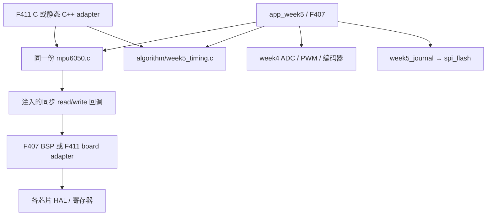

# 分层与接口

设备和计时算法不包含 HAL。两平台项目引用同一路径的设备文件，不能分别复制后修改。F411 的 C++ 类仅持有静态设备状态，显式 Init 在硬件初始化之后执行，无虚函数、动态分配、异常或 RTTI。

| 接口 | 契约 |
|---|---|
| MpuRead / MpuWrite | 地址为 7 位；仅 BSP 左移；0 表示同步传输已经完成，正数不能表示异步受理；缓冲区归调用者，返回后可复用 |
| 错误 | -1 总线错误、-2 ID 错、-3 配置回读错、-4 数据过期；-10 BUSY、-11 TIMEOUT、-12 NACK、-13 输入无效；负数从适配层保留到设备 last_error |
| 重试 | 单次同步事务无内部重试循环；设备故障后 500 ms 冷却再探测，离线可持续后台探测；一次初始化重试有界，不承诺永久故障自动成功 |
| 时间 | MpuSample.time_us/A0 首字段是调用者读服务开始时间；A0 第三字段是服务完成减开始；两者均不是传感器内部采样时刻 |
| 有效性 | 仅 INT_STATUS.DATA_RDY 且整个 burst 成功才增加 samples；故障立即 valid=0；100 ms 无新数据转为过期；历史值不重新发送为新值 |
| MPU 设置 | ±2g、±250 °/s、DLPF=3、DIV=1；ax/ay/az 除 16384 得 g，gx/gy/gz 除 131 得 °/s，温度 raw/340+36.53 °C |
| UART 队列 | 整帧复制到队列，DMA 完成后才复用；满队列丢整帧并计数；16 帧容量不是无限缓冲 |
| Flash | StartProgram 复制输入；Service 每次最多一笔 ≤68 字节传输；不忙等器件内部擦写；错误锁定，显式重新初始化和保留区配置后才允许重试 |

F407 的 I2C 回调使用 3 ms HAL 超时，F411 为 2 ms，粒度为 SysTick。正常时序需在接线正确时实测。BUSY 预检查外存在进入 HAL 的竞态，其内部 BUSY 等待上限仍可能为 25 ms；故障时允许失约但必须计数。恢复仅有限 SCL 脉冲和外设重置，不复位整板。SPI 单笔 3 ms 超时，正常 68 字节在现有分频下约 829 μs。

温湿度/LCD 物理驱动未在提供的仓库中找到。`W5Extras_*` 是明确缺失的适配接口，默认 capabilities=0；stage3/4/5 会拒绝启动，不会把模拟更新算成完成。接入真实驱动后，TH 每轮最多一个短事务，内部转换使用截止时间；LCD 一次仅更新局部，单步预算 1000 μs。具体型号和时序需实物手册确认。
